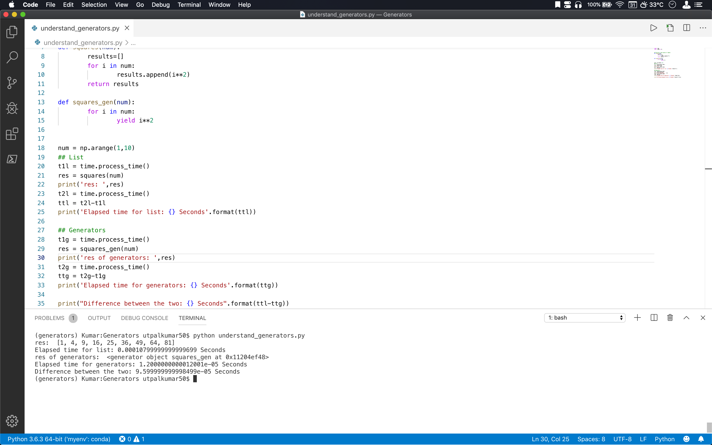
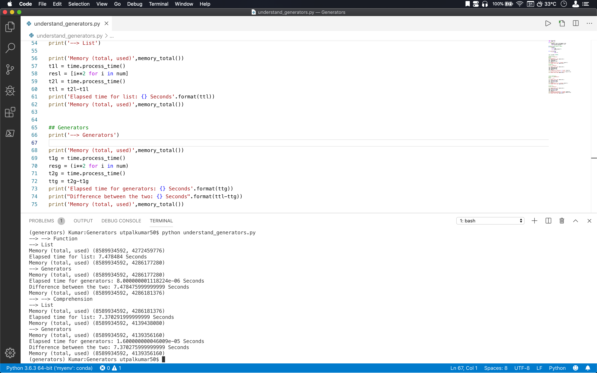

# What are generators and why we wanna use them?

- Generators don't hold the entire result in memory. It yields one result at a time. 
- Ways of creating generators:
    1. Using a function
        ```
        def squares_gen(num):
                for i in num:
                        yield i**2
        ```
        ```
        def squares(num):
                results=[]
                for i in num:
                        results.append(i**2)
                return results
        ```
        - Elapsed time for list: `7.360722` Seconds

        - Elapsed time for generators: `5.999999999950489e-06` Seconds

        - Difference in time taken for the list and generators: `7.360716` Seconds for `num = np.arange(1,10000000)`
    2. Like a list comprehension
        ```
        resl = [i**2 for i in num]
        ```
        ```
        resg = (i**2 for i in num)
        ```
        - Elapsed time for list: `7.663468000000001` Seconds

        - Elapsed time for generators: `9.999999999621423e-06` Seconds

        - Difference in time taken: `7.663458000000001` Seconds for `num = np.arange(1,10000000)`

- Getting the results from the generator function:
    1. Using `next`
        ```
        resg = squares_gen(num)
        print('res of generators: ',next(resg))
        print('res of generators: ',next(resg))
        print('res of generators: ',next(resg))
        ```
    2. Using `loop`:
        ```
        for n in resg:
            print(n)
        ```


## Advantages of using generators:
1. The generator codes are more readable.
2. Generators are much faster and uses little memory.

## Results:
1. Using function is a faster way of creating values in Python than using loop or list comprehension for both lists and generators.
2. The difference between using list or generators is more pronounced when using a comprehension (though generators are still much faster.)
3. When we need the result of whole array at a time then the amount of time (or memory) taken to create a list or `list(generators)` are almost same.

</img>

</img>

Overall, generators gives a performance boost not only in execution time but with the memory as well.

## Appendix
### How I calculated the time taken by the process
- Calculate sum of the system and user CPU time of the current process.
    - `time.process_time` provides the system and user CPU time of the current process in seconds.
    - Use `time.process_time_ns` to get the result in nanoseconds

__NOTE:__ The "time taken" shown in this study is subjective to different computers and varies each time depending on the state of the CPU. But each and everytime, the using generators are much faster.